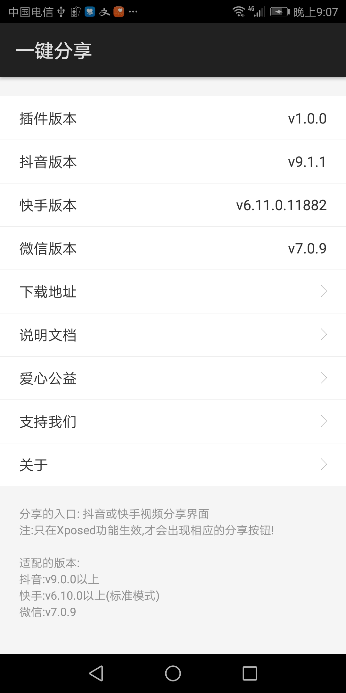
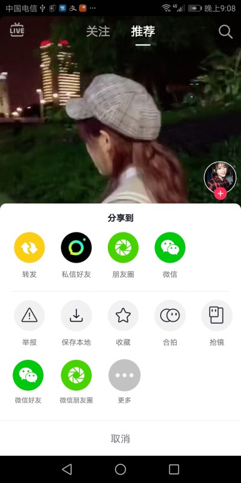

## 一键分享
这是一个视频分享插件

### Xposed Module Repository
[http://repo.xposed.info/module/com.sky.xposed.share](http://repo.xposed.info/module/com.sky.xposed.share)

### 主要的功能
1. 把 __抖音视频__ 无水印分享到微信好友与微信朋友圈
2. 把 __快手视频__ 无水印分享到微信好友与微信朋友圈

### 分享的入口
抖音或快手 __分享__ 界面

### 1.0.0支持的版本
抖音:v9.0.0以上  
快手:v6.10.0以上(标准模式)  
微信:v7.0.9 

### 截图

### 支持我们

### 声明
本软件只学习与个人使用，如用侵犯您的权益请即时与作者联系.  
邮箱: jingcai.wei@163.com

